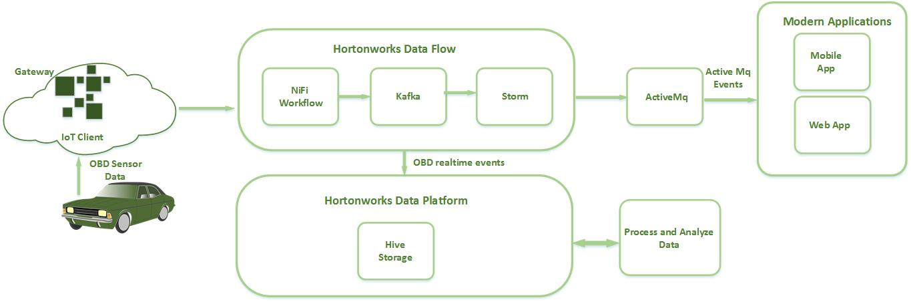

# Driving IOT Bus system
This project is meant to be a reference application for Driving IOT Bus system The project consists of 4 projects:

1. **driving-IoT-bus-storm-topology** - Storm Topology to process bus events in realtime
2. **driving-IoT-bus-app-env-setup** - Set of scripts to build the Driving-iot-bus-storm-topology
3. **driving-IoT-bus-webserver** - A web application that allows you to deploy the storm topology and tap into the real-time bus data using websockets from ActiveMQ and Storm
4. **driving-IoT-bus-flow-management** - Apache NiFi automates the movement of data between disparate data sources and systems, making data ingestion fast, easy and secure

## Business Use Case Setup:

 The OBD devices which plugged in buses generate the data (json) in every interval of time as driver moves and Iot field gateway then collects that data which establishes the requirements for HDF ingestion based on the number of devices and number of consumers.
 On the device side, the Driving Iot bus app, collects data which is generated from the obd devices through apache NIFI workflow and travels through apache kafka and storm topology and store into hive tables.

## IoT architecture

## Innovyt IoT Reference Architecture

## What does this Mobile Application Demonstrate:

* Stream Processing
* Collecting data from the OBD devices
* Flow Management - Data Acquisition, parsing, enrichment and intelligent routing
* Running the Mobile Application on HDF 2.0 / HDP 2.5

## Full End to End IOT App Built

## Installing and Running the IOT Driving App on HDP 2.5 / HDF 2.0

### Cluster Setup
Install HDF 2.0.X  cluster using instructions here: http://docs.hortonworks.com/HDPDocuments/HDF2/HDF-2.0.1/bk_ambari-installation/content/index.html.
Install all the components that come with the HDF 2.0 cluster:

* Nifi
* Storm
* Kafka
* Zookeeper
* ActiveMQ

### To set up Driving iot application ###

	Git clone the project into your working directory
	
### Configure Nifi - Flow Management
When you spin up an HDF 2.0.X cluster using Ambari, you have the option to install a Nifi cluster. Install 1 Node Nifi Cluster.

The following are instructions to import the flow management template into Nifi that allows you ingest, route, transform and deliver the driving events to the Kafka Cluster

1. From Ambari QuickLinks on the Nifi Service, click on the QuickLinks for the Nifi UI
2. On the Operate Window of the canvas, select upload template and upload the template called Nifi_Flow.xml located in iottransitdemo\driving-IoT-Bus-app\driving-IoT-bus-flow-management\nifi-driving-flow-management-template
3. Select the Template icon from the top menu item and drag to canvas and select the template you just uploaded.
4. Configure each of the processors on the template with your cluster settings (e.g: kafka cluster settings, etc..) and make it run.
	
### Configure kafka ###

	Create the Kafka Topic required by the application:

		In Ambari, find a node where a Kafka Broker is running. SSH into that node as root

			cd /usr/hdf/current/kafka-broker/bin

	Create kafka topic.. for Driving events (replace with your own zookeeperhost:host that the kafka broker is using) :
	Change the retention.ms in below command as per your requirement 

			./kafka-topics.sh --create --zookeeper [your_zookeeper_host]:2181 --replication-factor 1 --partition 5 --topic obdReadings --config retention.ms=30000

	Verify the topic got created by running the following:

			./kafka-topics.sh --list --zookeeper [your_zookeeper_host]:2181

### Configure Hive ###

	Log into a node with the hive client and do the following:

		Execute the hive table creation commands sequence found below, here just given an example how to create table in hive using few keys , but before then you have to add serde jar in your hive shell because data contains in json format : 

			hive 
			ADD JAR /home/vagrant/hive-jars/hive-json-serde.jar;
			
			CREATE EXTERNAL TABLE ObdEvents
			(VIN string,
			SPEED string,
			ENGINE_LOAD string,
			ENGINE_COOLANT_TEMP string,
			FUEL_LEVEL string,
			FUEL_CONSUMPTION_RATE string,
			FUEL_PRESSURE string,
			ENGINE_OIL_TEMP string
			)
			ROW FORMAT SERDE 'org.apache.hadoop.hive.contrib.serde2.JsonSerde' 
			with serdeproperties ( 'paths'='VIN,SPEED,ENGINE_LOAD, ENGINE_COOLANT_TEMP,FUEL_LEVEL,FUEL_CONSUMPTION_RATE,FUEL_PRESSURE, ENGINE_OIL_TEMP' )
			LOCATION '/tmp/obd_events/staging/' ;

	Verify these tables are creating by running the following in hive:

			select * from ObdEvents;

### Configure property file ###

	Log into the node where you installed the Maven Projects:

		cd [working directory where you installed maven projects]/driving-IoT-Bus-app/driving-IoT-bus-storm-topology/src/main/resources

	change driver-bus-storm-topology.properties file according to your cluster

		storm.zk.servers=[List of zookeeper servers(comma separated)]
		storm.nimbus.host=[nimbus host]
		storm.nimbus.port=[nimbus port]
		storm.zk.port=[zookeeper port]
		storm.zk.root=[zookeeper root(check in storm configuration file)]

		lametro.activemq.connection.url=[ActiveMQ connection url]eg: tcp://10.10.1.141:61616
		
### To deploy storm topology ###

	Go to [project working directory]/driving-IoT-Bus-app/driving-IoT-bus-app-env-setup/storm-deployment/script folder and run topology_deployment.sh file:
	
		chmod 777 topology_deployment.sh
	
		./topology_deployment.sh [storm topology jar location] [main class path] [property file name]
	
		eg: ./topology_deployment.sh /root/.m2/repository/com/innovyt/Driving/Driving-storm-topology/0.0.1/Driving-storm-topology-0.0.1-shaded.jar com.innovyt.Driving.topology.StormTopologyMain Driving-storm-topology.properties

		
### Install ActiveMQ
1. Log into the node where you installed the Maven Projects in the earlier step as root
2. cd [your working directory]
3. mkdir activemq
4. cd activemq
5. wget http://archive.apache.org/dist/activemq/apache-activemq/5.9.0/apache-activemq-5.9.0-bin.tar.gz
6. tar -zxvf apache-activemq-5.9.0-bin.tar.gz

### Start ActiveMQ
1. Verify it is up by running:
	* activemq/apache-activemq-5.9.0/bin/activemq status
	* Hit the activeMQ console (credentials: admin/admin): 
		e.g:  http://[REPlACE_WITH_HOSTNAME]:8161/admin/topics.jsp
2. Leave ActiveMQ running

### Building the Driving-iot-mobile-app ###

	By mobile app, one can be sure that what the actual time and where the driver is and what route he is on.

	This project requires java 8 so export JAVA_HOME with jdk8
		
		cd [project working directory]/driving-IoT-Bus-app
		export $JAVA_HOME=[java 8 directory path]
		
	Run maven command to build driving-IoT-Bus-app
	
		mvn clean install -DskipTests=true		
		